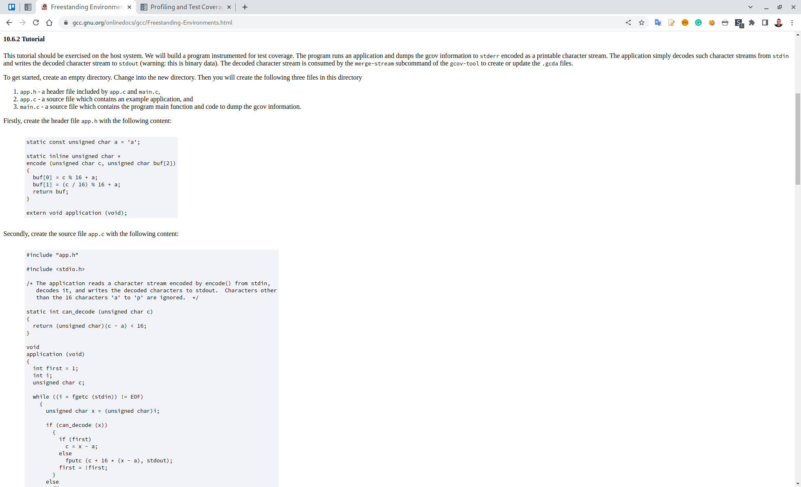
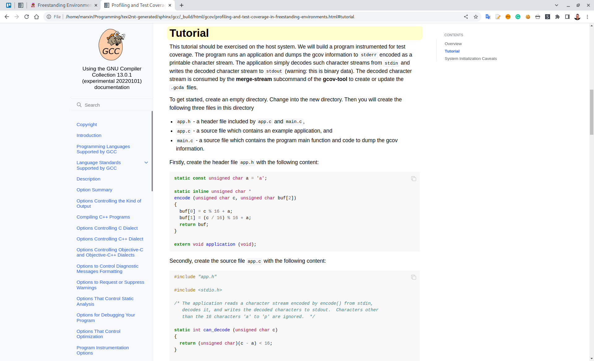
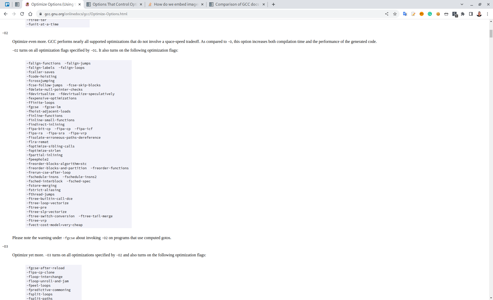
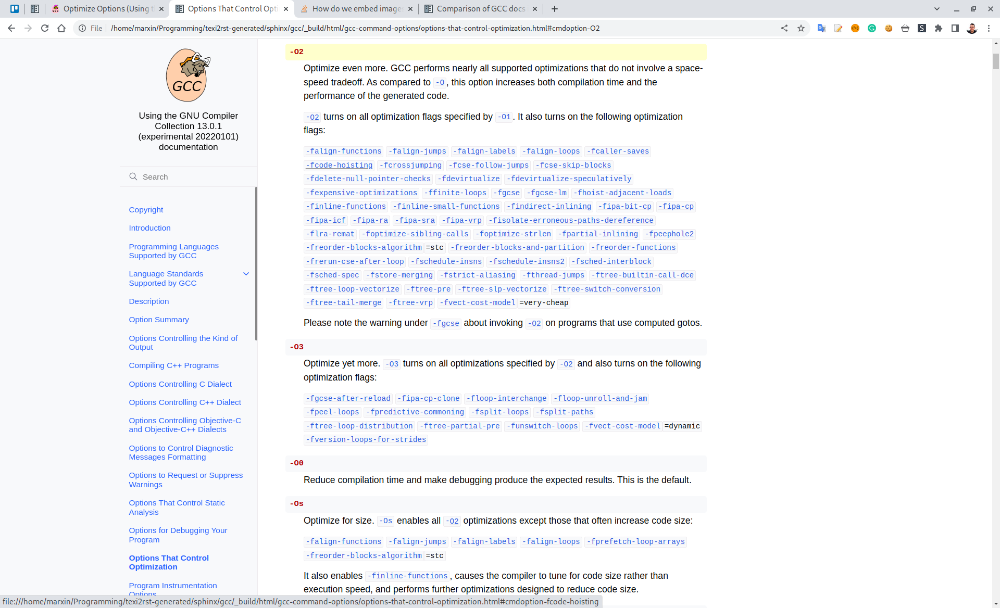
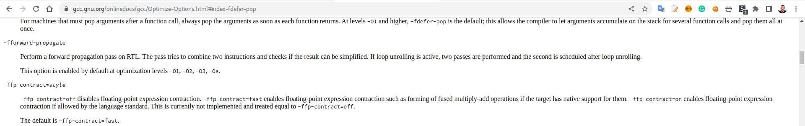
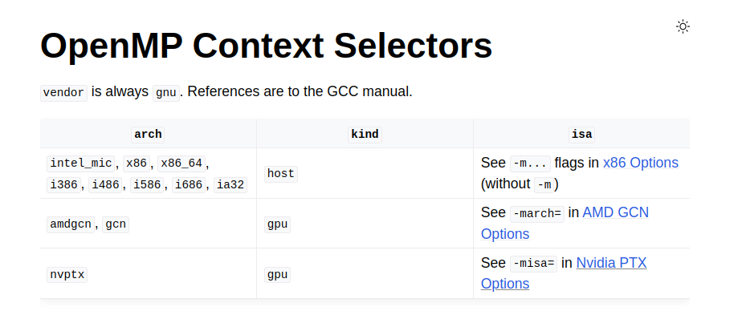

Comparison of GCC docs in Texinfo and Sphinx
============================================

HTML output
***********

Formatting
~~~~~~~~~~

Sphinx provides left menu navigation and side bar navigation (for subsections)
on a page. Moreover, it's using a richer CSS formats including the code highlighting
for code snippets, bash sessions or a JSON output.

Texinfo version:



Sphinx version (see :ref:`gcc:freestanding-environments`):



Links
~~~~~

Entire manual can be easily visited with cross-references for thinks like options, attributes, etc.

Texinfo version:



Sphinx version (see e.g. :option:`gcc:-O2`):



Built-in Search Engine
~~~~~~~~~~~~~~~~~~~~~~

Sphinx provides built-in search enging for a fast navigation:


Link location
~~~~~~~~~~~~~

HTML links for options are misplaced by Texinfo:



While it's precise for Sphinx (e.g. :option:`gcc:-fdefer-pop`):


Cross-manual references
~~~~~~~~~~~~~~~~~~~~~~~

Sphinx (using Intersphinx extension) provides an elagant way how to cross reference other manuals):
(e.g. ``:ref:`gcc:amd-gcn-options``` :ref:`gcc:amd-gcn-options`)



Function documentation
~~~~~~~~~~~~~~~~~~~~~~

Sphinx provides very rich directives when documenting a function, it's arguments, return value, etc.

.. code-block:: rst

    .. c:function:: PyObject *PyType_GenericAlloc(PyTypeObject *type, Py_ssize_t nitems)

    :param type: description of the first parameter.
    :param nitems: description of the second parameter.
    :returns: a result.
    :retval NULL: under some conditions.
    :retval NULL: under some other conditions as well.

which results in:

.. c:function:: PyObject *PyType_GenericAlloc(PyTypeObject *type, Py_ssize_t nitems)

    :param type: description of the first parameter.
    :param nitems: description of the second parameter.
    :returns: a result.
    :retval NULL: under some conditions.
    :retval NULL: under some other conditions as well.